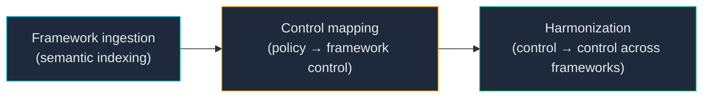
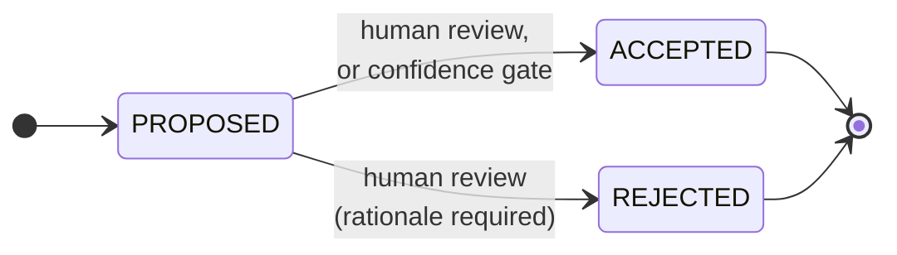

# How Lemma's AI Works

Lemma uses AI to accelerate compliance work, never to decide it. Every AI decision is recorded with full context, remains in a `PROPOSED` state until a human or a confidence gate reviews it, and can be audited, queried, or revoked after the fact.

This page explains what the AI actually does, what it doesn't do, and how to verify any output it produces.

## The three things Lemma's AI does



### 1. Framework ingestion

Every bundled or imported compliance framework (NIST 800-53, CSF 2.0, 800-171) gets embedded using `sentence-transformers/all-MiniLM-L6-v2` — a 384-dimensional vector per control. Vectors live in a local ChromaDB collection at `.lemma/index/`.

No LLM is involved in this step. Embeddings are deterministic: re-indexing the same input produces the same vectors.

### 2. Control mapping — `lemma map`

For each policy chunk, Lemma:

1. Retrieves the top-K most similar controls via cosine similarity on the embedded controls.
2. Sends each candidate to an LLM with the policy excerpt and a fixed prompt asking for a confidence score (0.0–1.0) and a one-sentence rationale.
3. Records every call — prompt, raw output, parsed confidence, rationale, timestamp — as a single entry in the append-only trace log at `.lemma/traces/YYYY-MM-DD.jsonl`.

The trace entry for every mapping decision looks like this:

```json
{
  "trace_id": "3f9e...",
  "timestamp": "2026-04-22T15:01:32.489Z",
  "operation": "map",
  "input_text": "All users must authenticate via SSO before accessing systems.",
  "prompt": "You are a GRC compliance analyst. Given a policy excerpt...",
  "model_id": "ollama/llama3.2",
  "model_version": "",
  "raw_output": "{\"confidence\": 0.87, \"rationale\": \"...\"}",
  "confidence": 0.87,
  "determination": "MAPPED",
  "control_id": "ac-2",
  "framework": "nist-800-53",
  "status": "PROPOSED",
  "review_rationale": "",
  "parent_trace_id": "",
  "auto_accepted": false
}
```

The LLM's rationale is advisory. The policy-to-control link only becomes part of the compliance graph when the trace's `status` transitions to `ACCEPTED`.

### 3. Harmonization — `lemma harmonize`

Harmonization finds semantically equivalent controls across different frameworks (so the same policy can satisfy requirements in NIST 800-53, CSF 2.0, and 800-171 at once).

Today this is done by pairwise cosine similarity with a Union-Find clustering pass — no LLM, no trace emission. Equivalences above the similarity threshold (default 0.85) are grouped into a Common Control Framework.

Harmonization does not yet write to the trace log. That's tracked as issue #92 — when that ships, harmonization decisions will carry the same `PROPOSED → ACCEPTED/REJECTED` lifecycle as mapping.

## The trust model

Every AI decision transitions through three states:



- **`PROPOSED`** — the AI's output. Nothing downstream (graph edges, reports, evidence) treats this as authoritative yet.
- **`ACCEPTED`** — reviewed and confirmed. A new trace entry is appended with `parent_trace_id` pointing at the original. When the acceptance came from a confidence gate, `auto_accepted` is `true` and the applied threshold is recorded in `review_rationale`.
- **`REJECTED`** — reviewed and explicitly rejected. A rationale is required. The original PROPOSED entry is never mutated — the rejection is a separate, linked entry.

The trace log is **append-only and tamper-evident**. There is no `update`, `delete`, or `clear` on `TraceLog`. Changing a decision after the fact means appending a new review entry; the history stays intact.

## Confidence-gated automation

An organization that wants to accelerate review on high-confidence outputs can configure per-operation thresholds in `lemma.config.yaml`:

```yaml
ai:
  automation:
    thresholds:
      map: 0.85       # auto-accept mappings at confidence >= 0.85
      # harmonize: 0.95  # coming with issue #92
```

When a mapping is emitted at or above the threshold, a second trace entry with `status: ACCEPTED` and `auto_accepted: true` is appended immediately, linked to the original via `parent_trace_id`. Outputs below the threshold stay `PROPOSED` and queue for human review.

Threshold changes are themselves auditable: each `lemma map` run diffs the current config against the last recorded policy state and writes `threshold_set` / `threshold_changed` / `threshold_removed` events to `.lemma/policy-events/YYYY-MM-DD.jsonl`. Governance changes leave the same kind of append-only trail as the AI decisions they gate.

## The AI System Card

`lemma ai system-card` prints a versioned transparency document describing every model Lemma uses — its purpose, declared capabilities, known limitations, and training-data provenance. The current card is embedded in the static docs at [AI System Card](../reference/ai-system-card.md).

The system card is the authoritative answer to "which AI is responsible for this output?". It's versioned independently of the Lemma release so auditors can pin the exact AI configuration in force for a given evidence snapshot. Automating the card's publication into every release artifact is tracked as issue #93.

## How to verify any AI output

1. Find the output in question (a mapping result, a graph edge, a harmonization group).
2. Run `lemma ai audit --status PROPOSED` (or `ACCEPTED` / `REJECTED`) to query the trace log. Filter by model, status, or summarize across the whole history.
3. Each audit row shows the `trace_id`, the input text, the model that generated it, the confidence, and the review state. Every field in the trace is inspectable — nothing is hidden behind the UI.
4. To see the full raw prompt and model response for a specific trace, read `.lemma/traces/YYYY-MM-DD.jsonl` directly. JSONL is the canonical format; the CLI is a convenience.

## What Lemma's AI explicitly does **not** do

- Make legal compliance determinations.
- Substitute for qualified auditor judgment.
- Drive regulatory enforcement decisions.
- Implement controls without human (or gate) review.
- Send customer data to external APIs when configured for local models (Ollama).

These constraints are encoded in the system card's `out_of_scope` list and enforced by the PROPOSED-by-default lifecycle.
