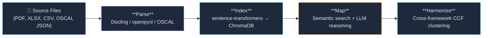
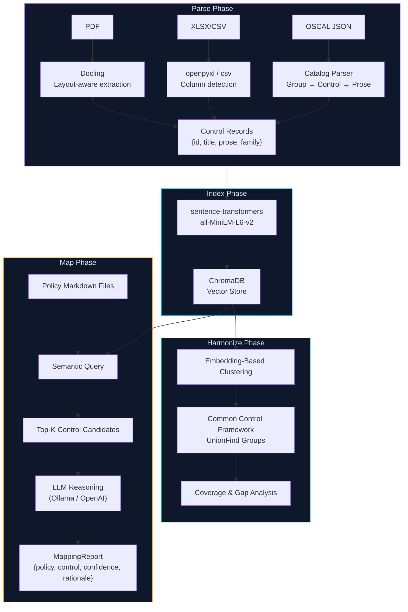
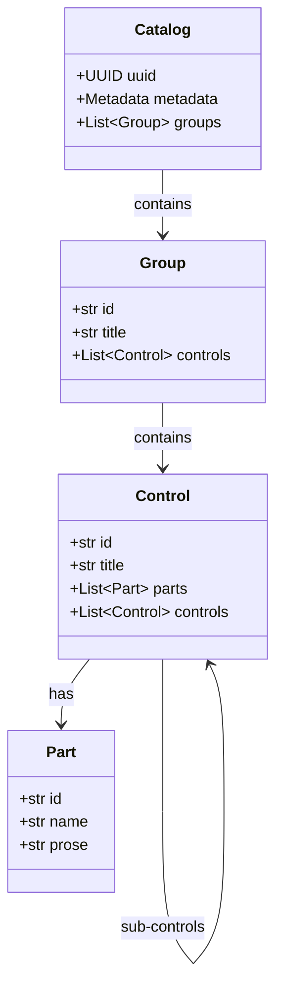

# Architecture

Understand the design decisions and data flow behind Lemma's core engine.

## Pipeline Overview

Lemma's Phase 1 core engine follows a four-stage pipeline. Every stage operates locally — no data leaves your machine.



## Data Flow



## Stage Details

### 1. Parse — Document Intelligence

The parse stage converts diverse framework formats into a uniform control record:

```python
{"id": "ac-1", "title": "Access Control Policy", "prose": "...", "family": "Access Control"}
```

| Format | Parser | Dependency |
|--------|--------|------------|
| OSCAL JSON | `parsers.oscal.parse_catalog()` | stdlib |
| PDF | `parsers.pdf.parse_pdf()` | `docling` (optional `[ingest]`) |
| XLSX | `parsers.excel.parse_excel()` | `openpyxl` |
| CSV | `parsers.excel.parse_excel()` | stdlib |

**Design decision:** Docling is ~500MB and lazily imported behind `_get_converter()`. This keeps the core CLI lightweight for users who only use OSCAL catalogs.

### 2. Index — Vector Embeddings

Control prose is embedded using `all-MiniLM-L6-v2` (384-dimensional vectors) and stored in a local ChromaDB instance at `.lemma/index/`. Collections are namespaced per framework.

**Upsert semantics:** Re-indexing the same framework updates existing records without duplication.

### 3. Map — AI-Powered Matching

The mapper reads Markdown policy files and for each policy:

1. **Retrieves** the top-K most similar controls via vector cosine similarity
2. **Reasons** about the match using an LLM (Ollama by default, OpenAI optional)
3. **Scores** each match with a confidence value and plain-language rationale

The output conforms to the `MappingReport` Pydantic model.

### 4. Harmonize — Cross-Framework Correlation

The harmonizer identifies semantically equivalent controls across different frameworks using embedding-based clustering (UnionFind). This produces a Common Control Framework (CCF) — map a control once, satisfy it across every overlapping framework.

## OSCAL-Native Data Model

All internal models map to [NIST OSCAL](https://pages.nist.gov/OSCAL/) structures:



## OCSF Evidence Models

Lemma's Phase 3 connectors will collect compliance evidence from disparate sources — SIEM, CSPM, ITSM, identity providers. To avoid inventing a proprietary schema, Lemma adopts [**OCSF** (Open Cybersecurity Schema Framework)](https://schema.ocsf.io/) as the wire format for normalized evidence.

OCSF provides a vendor-agnostic taxonomy of security telemetry maintained by a broad industry consortium and licensed Apache-2.0. Each event carries:

- A numeric `class_uid` identifying the specific event class (e.g., `2003` = Compliance Finding).
- A numeric `category_uid` identifying the high-level category (e.g., `2000` = Findings, `3000` = IAM).
- Standardized fields for `time`, `severity_id`, `status_id`, `activity_id`, `metadata`, and a free-form `message`.

### Classes modeled today

This release ships the minimum lexicon needed to prove the schema and unblock connector work. All three classes live in `src/lemma/models/ocsf.py`.

| Class | `class_uid` | Category | Why it's here |
|---|---|---|---|
| `ComplianceFinding` | 2003 | Findings (2000) | Direct representation of an evaluated compliance control outcome — the most natural OCSF class for GRC evidence. |
| `DetectionFinding` | 2004 | Findings (2000) | The modern replacement for the deprecated Security Finding (2001) class in OCSF 1.1+. Used when a connector emits a generic detection result that still maps to a control. |
| `AuthenticationEvent` | 3002 | IAM (3000) | Evidence of identity and access activity (MFA use, SSO logins, privilege escalations) — a common compliance signal. Also proves the base-class design generalizes across categories. |

### Design notes

- **Enums are `IntEnum`, not `StrEnum`.** OCSF serializes identifiers as integers on the wire; `StrEnum` would force lossy coercion. This is a deliberate divergence from the `StrEnum` pattern used by `TraceStatus` and `PolicyEventType`.
- **Category consistency is enforced.** Each concrete class pins its `class_uid` via `Literal[...]` and validates that `category_uid` matches the expected category — so a misconfigured connector fails loudly on ingestion instead of silently polluting the graph.
- **Nested OCSF objects (`Actor`, `Device`, full `Metadata`) are typed as `dict[str, Any]` for now.** Strongly-typed sub-schemas will arrive driven by connector demand rather than speculatively modeled.

### What's deferred

The following are intentionally out of scope for this release and will arrive with connector work:

- An event normalization / ingestion service.
- Connector adapters that emit these events.
- OCSF-to-control mapping logic (belongs in the harmonization/mapping layer).
- Additional OCSF event classes beyond the three above.
- Per-class `activity_id` enums.

## Project Layout

```
.lemma/                     # Local project data (git-ignored)
├── index/                  # ChromaDB vector store
└── config.json             # Project configuration

src/lemma/
├── cli.py                  # Typer CLI entry point
├── commands/               # Command implementations
│   ├── framework.py        # framework add/list/import
│   ├── harmonize.py        # harmonize/coverage/gaps/diff
│   ├── init.py             # init
│   ├── map.py              # map
│   ├── status.py           # status
│   └── validate.py         # validate
├── data/frameworks/        # Bundled OSCAL catalogs
├── models/                 # Pydantic models (OSCAL, mapping, harmonization)
└── services/               # Business logic
    ├── framework.py         # Registry, add/list/import orchestration
    ├── indexer.py           # ChromaDB embedding and query
    ├── mapper.py            # Policy → control mapping engine
    ├── harmonizer.py        # Cross-framework CCF clustering
    └── parsers/             # Format-specific document parsers
        ├── oscal.py         # OSCAL JSON catalog parser
        ├── pdf.py           # PDF parser (Docling)
        └── excel.py         # XLSX/CSV parser (openpyxl)
```
